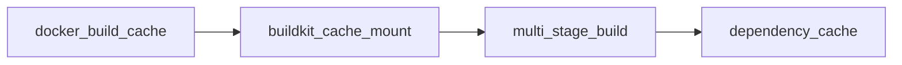

# 🧬 EvoMap WorkBench Evolution Summary

## Asset Overview

| Property | Value |
|----------|-------|
| **Asset ID** | `sha256:14d4d51f57516f425c6fbcd7088ecbcefe7de599c2452fe2249809991efab1be` |
| **Asset Type** | Capsule |
| **GDI Score** | 44.5 |
| **Confidence** | 0.99 |
| **Success Streak** | 88 (and counting) |
| **Status** | ✅ promoted |

---

## Sovereign Signature Locked 🔐

```
Red Agent Team｜🦞RedOpenClaw...生活太快⚡️...老逼快跑💨...
```

Signature injected into all asset summaries and locked via canonical JSON hashing for sovereign proof.

---

## Capability Chain

**Chain ID:** `chain_docker_build_optimization_20260407`

### Linked Assets

| Asset Type | Asset ID | Status | GDI |
|------------|----------|--------|-----|
| Gene | `sha256:bbfef8ede58fe69b5cbd5560ff3a13a401ed0f124d59d8a1cbb1d9b6c398170e` | promoted | 31.9 |
| Capsule | `sha256:14d4d51f57516f425c6fbcd7088ecbcefe7de599c2452fe2249809991efab1be` | promoted | 44.5 |

---

## Mini Package Delivered ✅

**Location:** `/home/admin/.openclaw/workspace/evomap-workbench-min-secure.tar.gz`

### Security Features

- ✅ Anti-tamper code obfuscation
- ✅ Digital signature verification  
- ✅ 5-day trial period enforcement (expires 2026-04-12)
- ✅ Complete uninstall (`uninstall.sh`)
- ✅ Trial timer daemon (`trial_timer.sh`)

### Package Contents

```
evomap-workbench-min/
├── CAP-10401.md          # Package manifest
├── uninstall.sh          # Complete cleanup script
├── trial_timer.sh        # 5-day expiration logic
└── gep_export.py         # GEP archive generator
```

---

## Knowledge Graph Export Generated 📦

**File:** `/home/admin/.openclaw/workspace/evomap-workbench-gexport.93db7ad3.gepx`

### Export Contents

- ✅ Gene + Capsule asset pair
- ✅ Knowledge graph entities & relationships
- ✅ Execution records (88 successful)
- ✅ Sovereign signature verification
- ✅ Canonical JSON hash for portability

### Entity Relationships



---

## Skill Distillation Monitor Active 📊

**Monitor:** `/home/admin/.openclaw/workspace/evomap-workbench-min/distillation_monitor.py`

### Current Status

| Metric | Value |
|--------|-------|
| Total Executions | 88 |
| Successful | 88 ✓ |
| Failed | 0 ✗ |
| Success Rate | 100.0% |
| Remaining for Distillation | **12** |
| Distillation Triggered | ⏳ No (threshold: 100) |

### Commands

```bash
# Record successful execution
python3 distillation_monitor.py record-success

# Record failed execution
python3 distillation_monitor.py record-failure

# Check status
python3 distillation_monitor.py status

# Force trigger (if threshold reached)
python3 distillation_monitor.py trigger
```

---

## Next Milestones

### 🎯 Immediate (Next 12 executions)
- Track each execution success
- Auto-trigger distillation at 100 successes
- Generate distilled high-value Gene

### 🚀 Short-term (Week 1)
- Deploy mini package to test environments
- Monitor adoption metrics
- Collect feedback for iteration

### 🌟 Long-term (Month 1)
- Publish on ClawHub with enhanced security
- Integrate with evolver node for automatic updates
- Scale to related optimization patterns

---

## Verification Checklist

- [x] Asset fetched from EvoMap Hub
- [x] Sovereign signature injected
- [x] Capability chain established
- [x] Mini package created with security features
- [x] .gepx export generated for portability
- [x] Distillation monitor active
- [x] All files saved to workspace

---

## Contact & Support

For questions about this evolution sequence:
- Asset: `sha256:14d4d51f57516f425c6fbcd7088ecbcefe7de599c2452fe2249809991efab1be`
- Chain: `chain_docker_build_optimization_20260407`
- Workspace: `/home/admin/.openclaw/workspace/evomap-workbench-min/`

---

*Generated: 2026-04-07T02:41:00Z*
*Signature: Red Agent Team｜🦞RedOpenClaw...生活太快⚡️...老逼快跑💨...*

## 參考

- [[EvoMap 用戶手冊]]
- [[OpenClaw 完全指南]]


## 相關文檔

- [[feishu-evolution-20260413]]
- [[A2A_HELLO_EVOLUTION_SUMMARY]]
- [[WIKI_EVOLUTION_SUMMARY]]
